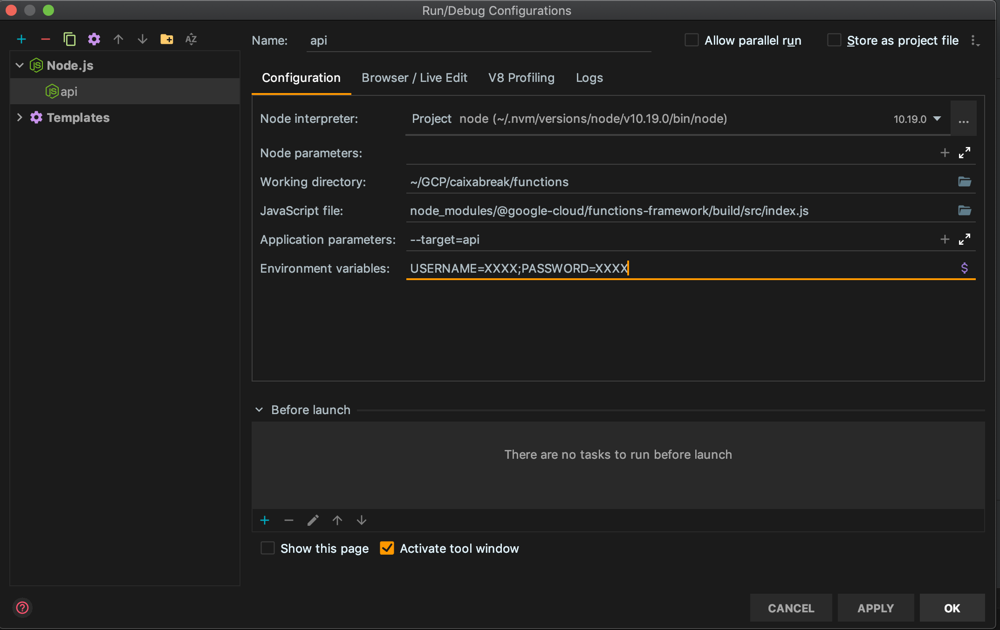

## Welcome to CaixaBreak project

This project was developed by a small team in their spare times in order to bring to life
an app capable of providing easy access to our caixa break card account.

Don't worry, we don't save any sensitive data (like your login credentials)
and the app is fully encrypted using ssl encryption.

If you want to be part of our team of awesome developers, please drop an
email to [caixa-break@renatocardoso.dev](mailto:caixa-break@renatocardoso.dev). You are more than welcome :) 

## Available Scripts

In the project directory, you can run:

### `npm start`

Runs the app in the development mode. 
Open [http://localhost:3000](http://localhost:3000) to view it in the browser.

The page will reload if you make edits. 
You will also see any lint errors in the console.

### `npm run build`

Creates an optimized production build. Output in `build` folder.

### `npm run deploy-hosting`

Deploys only the website part of the project (firebase hosting deploy only).

### `npm run deploy-functions`

Deploys only backend part of the website (firebase functions deploy only).

### `npm run deploy all`

Deploys the full stack to firebase.

## Running Firebase Backend

Add a new run configuration to your IDE of choice and set it up like shown below -
change the working directory and environment variables accordingly:

## Mock backend calls to local development and test edge cases

An alternative to the above configuration, is to use wire mock and setup mock data responses
from our backend service by running the following command:

`npm run mock`
